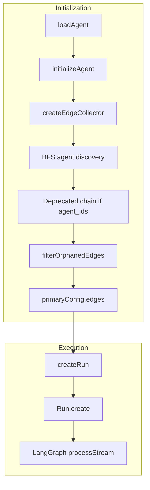

# Agent Chaining in LibreChat

This document explains how agent chaining works in LibreChat, how to schedule agents with different chaining types, and how to add a new sequential output-passthrough chaining type.

---

## 1. Introduction

LibreChat supports **multi-agent workflows** where multiple AI agents can collaborate within a single conversation. Agents can:

- **Hand off** to specialist agents when they need expertise (e.g., a generalist hands off to a data analyst)
- **Chain sequentially** so each agent builds on the output of the previous one (Mixture-of-Agents style)
- **Run in parallel** when multiple agents have no incoming edges and start simultaneously

The execution layer is built on **LangGraph** via the `@librechat/agents` package. The graph topology is defined by **edges** connecting agent nodes. Each edge describes how control and context flow from one agent to another.

**Key concepts:**

- **Agents**: LLM-backed nodes with instructions, tools, and model configuration
- **Edges**: Connections between agents; each edge has a type (`handoff` or `direct`) and optional prompt logic
- **Handoffs**: Dynamic routing where an agent invokes a transfer tool to pass the conversation to another agent
- **Direct transitions**: Automatic flow from one agent to the next when the first completes

---

## 2. Architecture Overview

### Graph-Based Execution

Agents run inside a LangGraph multi-agent graph. The graph is configured with:

- **Agents**: Array of agent configs (instructions, tools, model, etc.)
- **Edges**: Array of `GraphEdge` objects defining transitions

`createRun()` in [`packages/api/src/agents/run.ts`](packages/api/src/agents/run.ts) builds the `RunConfig`:

```typescript
const graphConfig: RunConfig['graphConfig'] = {
  signal,
  agents: agentInputs,
  edges: agents[0].edges,  // Edges come from the primary agent config
};
```

Edges drive transitions; the graph supports both handoffs (dynamic routing) and direct (automatic) flows.

### Key Files

| File | Purpose |
|------|---------|
| [`api/server/services/Endpoints/agents/initialize.js`](api/server/services/Endpoints/agents/initialize.js) | Collects edges, loads connected agents via BFS, applies deprecated chain when `agent_ids` is present |
| [`packages/api/src/agents/edges.ts`](packages/api/src/agents/edges.ts) | `createEdgeCollector`, `filterOrphanedEdges`, edge deduplication |
| [`packages/api/src/agents/chain.ts`](packages/api/src/agents/chain.ts) | Deprecated `createSequentialChainEdges` helper |
| [`packages/data-provider/src/types/agents.ts`](packages/data-provider/src/types/agents.ts) | `GraphEdge` type definition |

---

## 3. Edge Types and Chaining Modes

### GraphEdge Structure

Defined in [`packages/data-provider/src/types/agents.ts`](packages/data-provider/src/types/agents.ts):

| Field | Type | Description |
|-------|------|-------------|
| `from` | `string \| string[]` | Source agent ID(s) |
| `to` | `string \| string[]` | Target agent ID(s) |
| `edgeType` | `'handoff' \| 'direct'` | `handoff` = transfer tool; `direct` = automatic transition |
| `prompt` | `string \| ((messages, runStartIndex) => string \| undefined)` | Context added when transitioning; supports `{results}`, `{convo}` in strings |
| `excludeResults` | `boolean` | When true, previous messages are excluded; only the prompt content is passed |
| `condition` | `(state) => boolean \| string \| string[]` | Optional routing logic |
| `promptKey` | `string` | For handoffs: parameter name for handoff input (default `"instructions"`) |
| `description` | `string` | Optional edge description |

### Handoff Edges (`edgeType: 'handoff'`)

- **Creates a transfer tool** that the supervisor agent can call when it wants to pass the conversation to another agent
- The agent **decides when** to hand off; routing is dynamic
- Supports passing instructions via `prompt` and `promptKey`
- **Transitive handoffs** (A→B→C) are supported via BFS discovery during initialization
- **UI**: [`client/src/components/SidePanel/Agents/Advanced/AgentHandoffs.tsx`](client/src/components/SidePanel/Agents/Advanced/AgentHandoffs.tsx)

### Direct Edges (`edgeType: 'direct'`)

- **Automatic transition** when the source agent completes
- Allows **parallel execution** when multiple agents have no incoming edges
- `prompt` on the edge is added as context when transitioning
- With `excludeResults: true`, message history is replaced by the prompt content
- Used by the deprecated agent chain (see below)

### Deprecated Agent Chain (`agent_ids`)

The legacy **Agent Chain** (Mixture-of-Agents style) uses the deprecated `agent_ids` field:

- **Sequential chain**: Primary agent plus an ordered list of chained agents
- **UI**: [`client/src/components/SidePanel/Agents/Advanced/AgentChain.tsx`](client/src/components/SidePanel/Agents/Advanced/AgentChain.tsx) (visible when `chain` capability is enabled in [`librechat.yaml`](librechat.yaml))
- **Conversion**: `agent_ids` is converted to direct edges via `createSequentialChainEdges` with template `{convo}` (full conversation buffer)
- **Default template** in [`packages/api/src/agents/chain.ts`](packages/api/src/agents/chain.ts):

  ```
  Based on the following conversation and analysis from previous agents, please provide your insights:

  {convo}

  Please add your specific expertise and perspective to this discussion.
  ```

- **`hide_sequential_outputs`**: When set, the UI filters content parts to show only the final output and tool calls, hiding intermediate agent responses

---

## 4. Data Flow: From Request to Execution



**Initialization flow:**

1. `initializeClient` receives the primary agent and loads it via `initializeAgent`
2. `createEdgeCollector` seeds with the primary agent’s `edges`
3. **BFS agent discovery**: For each edge target not yet loaded, `processAgent` loads it and `collectEdges` merges its edges
4. If `agent_ids` is present (deprecated), `createSequentialChainEdges` generates direct edges and adds them
5. `filterOrphanedEdges` removes edges pointing to missing agents
6. `primaryConfig.edges` holds the final edge set

**Execution flow:**

1. `AgentClient.chatCompletion` calls `createRun({ agents, ... })` with `edges: agents[0].edges`
2. `run.processStream` executes the LangGraph and streams results

---

## 5. Scheduling Agents with Chaining

### Scheduled Agents Overview

- **Controllers**: [`api/server/controllers/scheduledAgents.js`](api/server/controllers/scheduledAgents.js) – CRUD and manual run
- **Execution**: [`api/server/services/ScheduledAgents/executeAgent.js`](api/server/services/ScheduledAgents/executeAgent.js) – Uses `buildOptions` + `initializeClient`

### How Chaining Applies to Scheduled Runs

`executeScheduledAgent` runs the same initialization path as interactive chat:

1. Loads the agent by `agentId` via `buildOptions` → `loadAgent` → full agent (including `edges`, `agent_ids`)
2. Calls `initializeClient` with that agent
3. Graph topology (handoffs, direct edges, deprecated chain) is built the same way as for interactive chat
4. The schedule’s `prompt` is the user message sent to the agent
5. Any chaining (handoffs or sequential chain) runs as usual

**To schedule agents with different chaining types:**

| Chaining Type | How to Configure | Agent Config |
|---------------|------------------|--------------|
| **Handoff chaining** | Use an agent with `edges` where `edgeType: 'handoff'` | Add handoff targets in the agent’s Advanced settings |
| **Sequential chain** | Use an agent with `agent_ids` (deprecated) or define `edges` with `edgeType: 'direct'` | Add chained agents and optional `prompt`/`excludeResults` on edges |
| **Parallel agents** | Use an agent with multiple targets via `addedConvo` or edges with no incoming edges | Multi-convo or direct edges to start nodes |

Any agent that works in chat (single, handoff, or chained) can be scheduled. The schedule only provides the initial prompt; the agent’s graph defines the rest of the flow.

---

## 6. Adding a New Sequential Output-Passthrough Chaining Type

### Current Behavior

The deprecated chain uses `{convo}`:

- Each agent receives a **full buffer string** of all messages in the run
- A wrapper template (“Based on the following conversation...”) wraps that buffer
- With `excludeResults: true`, raw messages are excluded; only the templated prompt is used

### Proposed: Sequential Output Passthrough

**Goal:** Each agent receives the **last assistant output** of the previous agent as its main input, without a wrapper template.

**Use case:** Pipeline-style flows (e.g., Agent A drafts → Agent B refines → Agent C summarizes).

### Implementation Outline

#### 1. New Edge Helper

Add `createSequentialOutputPassthroughEdges` in [`packages/api/src/agents/chain.ts`](packages/api/src/agents/chain.ts) (or a new file):

- Signature: `createSequentialOutputPassthroughEdges(agentIds: string[]): Promise<GraphEdge[]>`
- Edges: `from`→`to`, `edgeType: 'direct'`, `excludeResults: true`
- `prompt` function: extract the **last AI message** from `messages.slice(startIndex)` and return its content directly

#### 2. GraphEdge Support

`GraphEdge` already supports `prompt: (messages, startIndex) => string | Promise<string>`. The implementation should:

- Find the last AI/assistant message in the run
- Return its content as the prompt (no template)
- Fall back to `getBufferString(runMessages)` if no AI message is found

#### 3. Integration Options

- Add `chainType: 'output_passthrough'` to the agent config; when set, use the new helper instead of `createSequentialChainEdges`
- Or extend `agent_ids` with a flag, or add `sequential_chain: { agentIds: string[], outputMode: 'convo' | 'last_output' }`

#### 4. Files to Modify

| File | Change |
|------|--------|
| [`packages/api/src/agents/chain.ts`](packages/api/src/agents/chain.ts) | Add `createSequentialOutputPassthroughEdges` |
| [`api/server/services/Endpoints/agents/initialize.js`](api/server/services/Endpoints/agents/initialize.js) | Branch on chain type when `agent_ids` (or new config) is present |
| [`packages/data-provider/src/types/agents.ts`](packages/data-provider/src/types/agents.ts) | Document or extend types for the new config |
| [`packages/api/src/agents/validation.ts`](packages/api/src/agents/validation.ts) | Add validation for new schema fields if needed |

### Example Prompt Function for Output Passthrough

```typescript
import { BaseMessage, getBufferString } from '@langchain/core/messages';
import type { GraphEdge } from '@librechat/agents';

export async function createSequentialOutputPassthroughEdges(
  agentIds: string[],
): Promise<GraphEdge[]> {
  const edges: GraphEdge[] = [];

  for (let i = 0; i < agentIds.length - 1; i++) {
    const fromAgent = agentIds[i];
    const toAgent = agentIds[i + 1];

    edges.push({
      from: fromAgent,
      to: toAgent,
      edgeType: 'direct',
      prompt: async (messages: BaseMessage[], startIndex: number) => {
        const runMessages = messages.slice(startIndex);
        const lastAi = [...runMessages].reverse().find(
          (m) => m._getType?.() === 'ai' || (m as { type?: string }).type === 'ai'
        );
        return lastAi?.content && typeof lastAi.content === 'string'
          ? lastAi.content
          : getBufferString(runMessages); // fallback
      },
      excludeResults: true,
      description: `Sequential output passthrough from ${fromAgent} to ${toAgent}`,
    });
  }

  return edges;
}
```

This keeps the graph structure the same while changing how context is passed between agents: only the last assistant output is forwarded, suitable for refinement and summarization pipelines.
