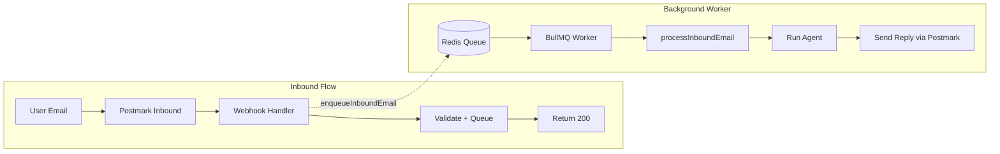

# Email My Agent

This document explains how the "Email My Agent" feature works in LibreChat: users can email agents and receive AI-generated replies via Postmark. The feature uses Postmark inbound webhooks plus a BullMQ job queue for asynchronous processing.

---

## 1. Introduction

LibreChat supports **inbound email** so users can interact with agents via email:

- **Send an email** to an agent-specific address; the agent processes the message and runs its tools
- **Attach files** (PDF, images, documents); attachments are saved to your files and available to the agent like chat uploads
- **Receive a reply** as a plain-text email with the agent's response, reasoning (if any), and tool call summaries
- **Thread conversations** by replying to the agent's email; subsequent replies continue the same conversation

The system uses **Postmark** for both receiving inbound emails (webhook) and sending replies. Processing is **asynchronous**: the webhook immediately returns 200 and queues the payload in Redis; a BullMQ worker runs the agent and sends the reply in the background.

---

## 2. Architecture

### Flow Diagram



### Key Points

- **Webhook always returns 200** to Postmark. No 4xx/5xx responses—failures are logged and ignored from Postmark's perspective, avoiding retries and information leakage.
- **Processing is asynchronous** via Redis and BullMQ. Jobs are retried automatically (3 attempts, exponential backoff) if processing fails.
- **Worker starts at boot** alongside the scheduled agents worker, when Redis is available.

### Key Files

| File | Purpose |
|------|---------|
| [api/server/controllers/inboundEmail.js](api/server/controllers/inboundEmail.js) | Webhook handler; validates, enqueues payload, always returns 200 |
| [api/server/services/InboundEmail/jobQueue.js](api/server/services/InboundEmail/jobQueue.js) | BullMQ queue and worker |
| [api/server/services/InboundEmail/processInboundEmail.js](api/server/services/InboundEmail/processInboundEmail.js) | Agent run, format response, send reply |

---

## 3. Prerequisites

- **Postmark** account with inbound parsing enabled (Inbound Message Stream)
- **Redis** (`USE_REDIS`, `REDIS_URI`) for the BullMQ job queue
- **POSTMARK_API_KEY** for sending replies (and optionally signature verification)
- **POSTMARK_FROM** or **EMAIL_FROM** for the reply sender address

---

## 4. Setup Steps

1. **Configure Postmark Inbound Message Stream**  
   In Postmark: Server → Inbound → Settings → Webhook URL:
   ```
   https://your-domain/api/inbound/email/<INBOUND_EMAIL_PATH_SECRET>
   ```
   Replace `<INBOUND_EMAIL_PATH_SECRET>` with a random secret you will set in env (e.g. a UUID or long random string).

2. **Set environment variables** (see [Environment Variables](#7-environment-variables) below).

3. **Assign `inboundEmailToken`** to each agent that should receive email. This can be done via the API or agent editor when creating or updating agents.

---

## 5. Email Address Format (MailboxHash)

Postmark uses **plus-addressing** (also called tag addressing). The `MailboxHash` is the part after `+` in addresses like `inbound+token@yourdomain.com`:

| MailboxHash | Meaning |
|-------------|---------|
| `agentToken` | New conversation; routes to the agent with that `inboundEmailToken` |
| `agentToken__conversationId` | Reply; continues the existing conversation (delimiter is `__`) |

### Examples

- **New conversation**: `inbound+myagent123@inbound.postmarkapp.com`  
  → Routes to agent with `inboundEmailToken: "myagent123"`

- **Reply**: `inbound+myagent123__conv-uuid-here@inbound.postmarkapp.com`  
  → Same agent, same conversation; the agent receives prior messages as context

The reply email uses a `Reply-To` header so that when the user clicks "Reply" in their email client, the To address includes the conversation ID for threading.

---

## 6. Agent Configuration

- **Schema field**: `inboundEmailToken` (string, optional, indexed)
- **Set via**: API or agent editor when creating or updating agents
- **Uniqueness**: Each token should be unique per agent; it identifies the agent for routing

### References

- Schema: [packages/data-schemas/src/schema/agent.ts](packages/data-schemas/src/schema/agent.ts)
- Lookup: [api/models/Agent.js](api/models/Agent.js) (`getAgentByInboundToken`)

---

## 7. Environment Variables

| Variable | Required | Description |
|----------|----------|-------------|
| `INBOUND_EMAIL_PATH_SECRET` | Yes | Random string for webhook URL; must match the path segment in Postmark config |
| `POSTMARK_API_KEY` | Yes (for replies) | Used by `sendInboundReply` to send agent replies |
| `POSTMARK_FROM` | No | Reply From address; falls back to `EMAIL_FROM` |
| `INBOUND_EMAIL_DEFAULT_AGENT_TOKEN` | No | Fallback when MailboxHash is empty |
| `INBOUND_EMAIL_WEBHOOK_SECRET` | No | Signature verification secret; defaults to `POSTMARK_API_KEY` |
| `INBOUND_EMAIL_SKIP_SIGNATURE_VERIFICATION` | No | Set to `true`; Postmark inbound does not send `X-Postmark-Signature` |
| `INBOUND_EMAIL_QUEUE_CONCURRENCY` | No | BullMQ worker concurrency (default 2) |
| `USE_REDIS`, `REDIS_URI` | Yes (for queue) | BullMQ requires Redis |
| `RAG_API_URL` | No (for attachments) | When set, PDF/document attachments are embedded for `file_search` |

---

## 8. Reply Format

Replies are plain text. The body includes (when present):

- **Reasoning/thinking block** wrapped in `---`
- **Main text content**
- **Tool call summaries** (name, args, output, truncated)

Defined in [api/server/utils/formatEmailHighlights.js](api/server/utils/formatEmailHighlights.js).

---

## 9. Attachments

Attachments in inbound emails are captured and saved to the user's files, then passed to the agent like chat file attachments.

- **Supported types**: Same as agents endpoint—PDF, images, documents, etc. (see `fileConfig.endpoints.agents.supportedMimeTypes`)
- **Size limits**: Respects `fileConfig.endpoints.agents.fileSizeLimit` (default 512 MB per file)
- **Storage**: Uses the configured file strategy (Local, S3, Azure Blob, Firebase)—same as regular uploads
- **Vector embedding**: When `RAG_API_URL` is set, PDF and document attachments are embedded for the `file_search` tool so the model can search and read them
- **Agent access**: Saved files are passed to the agent as `requestFiles`. The message includes an attachment hint so the model knows to use `file_search`. The agent must have the `file_search` tool enabled
- **Partial failure**: If one attachment fails (e.g., invalid base64, unsupported type), it is logged and skipped; others are still processed and the reply is sent

Attachments appear in the user's Files and conversation history like files added via the chat UI.

Defined in [api/server/services/InboundEmail/processEmailAttachments.js](api/server/services/InboundEmail/processEmailAttachments.js).

---

## 10. Security

- **Path secret**: Obscures the webhook URL and acts as a shared secret. Required. Keep it random and private.
- **Signature verification**: Postmark inbound webhooks typically do not send `X-Postmark-Signature`. Use `INBOUND_EMAIL_SKIP_SIGNATURE_VERIFICATION=true` and rely on the path secret plus Postmark IP whitelisting.
- **Sender verification**: Only LibreChat users whose account email matches the `From` address can email an agent. The sender must have VIEW access to that agent (either as the agent author or via explicit ACL permissions). Emails from unknown senders or users without access are logged and discarded; no reply is sent.
- **Never return 4xx/5xx** to Postmark; the webhook always returns 200 so Postmark does not retry and no error details leak.

---

## 11. Troubleshooting

| Issue | Cause | Action |
|-------|-------|--------|
| Emails not processed | Redis unavailable | Check `USE_REDIS`, `REDIS_URI`; worker logs a warning at startup if Redis is missing |
| Agent not found | Wrong token in MailboxHash | Verify the agent's `inboundEmailToken` matches the address (the part after `+`) |
| No reply sent | Postmark not configured | Set `POSTMARK_API_KEY` and `POSTMARK_FROM` (or `EMAIL_FROM`) |
| Email discarded (no reply) | Sender not a LibreChat user or no agent access | Ensure the From address matches a LibreChat account email and the user has VIEW access to the agent |
| Webhook 404 / path mismatch | Path secret mismatch | Ensure the URL configured in Postmark exactly matches `INBOUND_EMAIL_PATH_SECRET` |
| Empty message body | Subject-only or stripped reply | Postmark may strip content; ensure the email has body content |

---

## 12. Key Files Reference

| File | Purpose |
|------|---------|
| [api/server/routes/inboundEmail.js](api/server/routes/inboundEmail.js) | Route; mounted before `express.json` for raw body |
| [api/server/controllers/inboundEmail.js](api/server/controllers/inboundEmail.js) | Webhook handler; validate, queue, always 200 |
| [api/server/services/InboundEmail/jobQueue.js](api/server/services/InboundEmail/jobQueue.js) | BullMQ queue and worker |
| [api/server/services/InboundEmail/processInboundEmail.js](api/server/services/InboundEmail/processInboundEmail.js) | Agent run, format, send reply |
| [api/server/services/InboundEmail/processEmailAttachments.js](api/server/services/InboundEmail/processEmailAttachments.js) | Process and save email attachments to user files |
| [api/server/services/sendInboundReply.js](api/server/services/sendInboundReply.js) | Postmark API to send reply |
| [api/server/utils/formatEmailHighlights.js](api/server/utils/formatEmailHighlights.js) | Format response for email body |
| [api/models/Agent.js](api/models/Agent.js) | `getAgentByInboundToken` |
